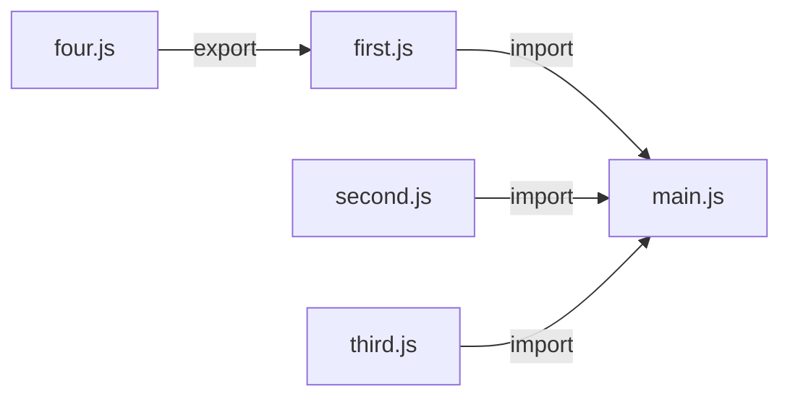

# 什么是bundler? 
bundler就是根据一个入口文件，沿着着各种导入导出语句（import/export），将一整个js库进行分析生成ModuleGraph，然后根据ModuleGraph生成html/css/js的chunk。
# 一个bundler的组成


## moduleGraph
在使用市面上任何一种bundler，都需要提供入口也就是entry文件，假设为main.js文件，
它的引用关系图如下。 每个文件相当于一个节点而import/export语句则是桥梁。沿着这些import/export语句就能将所有module过一遍，把所有module集合在一起生成一个moduleGraph。




```js title:examples.js
//main.js
import a from 'first'
import b from 'second'
import c from 'third'
console.log(a,b,c)

//first.js
export { a } from 'four'

//second.js
export function b () {};

//third.js
export var c = 42
//four.js
let a = 1
export default a;
```


具体实现也很简单：
1. 从main.js出发，得到main.js绝对文件地址，加载得到main.js源代码，对代码进行AST分析
2. 将import和export语句的AST摘出。得到import文件地址
3. 每次分析完一个js文件，就将js代码转成module。module存储了源码字符串和AST,然后将module塞入ModuleArray。直到所有文件分析完毕，moduleArray存储的module按顺序为:'main','first','four','second', 'third'。

### importDeclaration

### exportDeclaration
exportDeclaration: 


## chunk
chunk阶段得到moduleArray后，要将上面`example.js` 生成如下的`chunk.js`：
```js title:chunk.js

//four.js
let a = 1
//second.js
function b () {};
//third.js
export var c = 42
//main.js

console.log(a,b,c)
```
`chunk.js` 相比`example.js` 不仅包的数量减少了，代码也大大降低了。
 chunk的过程：
1. 排序: 要将moduleArray按照执行的先后顺序进行排序，也就是four->seconde->third->main，得到的orderModule。
2. 转换：迭代orideredModule将import语句删除，export语句根据情况进行代码转换或者删除。
3. 拼接：orderedModule剩下的源码字符串拼接在一起就得到最终的chunk。
通常情况下会把步骤1和2抽象为link流程，link流程通过import和export语句来把各种Identifier连接起来。
以上就是 一个bundler的基础流程。

